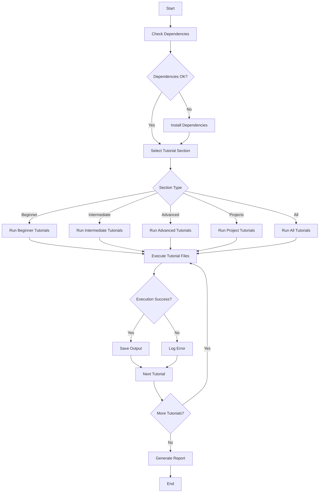
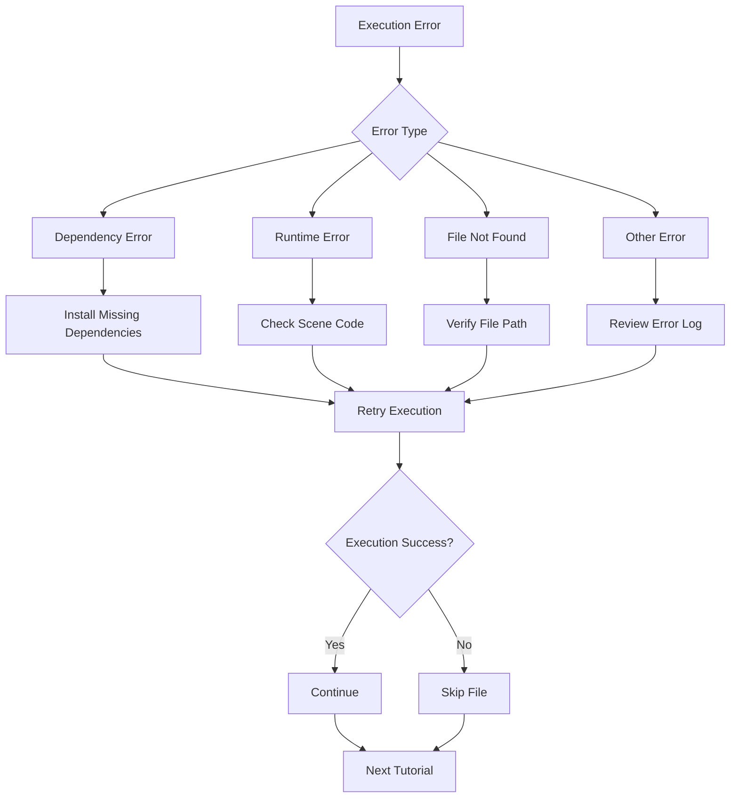

# Manim Tutorial Execution Workflow

This document illustrates the workflow for systematically executing all Manim tutorial files.

## Workflow Diagram

## Detailed Workflow Steps

### 1. Preparation Phase

1. **Dependency Check**
   - Verify Manim installation
   - Check for required system dependencies (FFmpeg, LaTeX, etc.)
   - Ensure Jupyter and ipywidgets are installed for interactive tutorials

2. **Environment Setup**
   - Set up output directories
   - Configure quality settings
   - Prepare logging mechanism

### 2. Execution Phase

1. **Section Selection**
   - Choose tutorial section to run (Beginner, Intermediate, Advanced, Projects)
   - Option to run all sections sequentially

2. **File Processing**
   - For each tutorial file:
     - Identify scene classes
     - Execute each scene with appropriate command
     - Handle errors and log results
     - Save output to designated directories

3. **Quality Management**
   - Apply consistent quality settings across all executions
   - Option to override quality per section or file
   - Monitor resource usage during high-quality renders

### 3. Monitoring Phase

1. **Progress Tracking**
   - Log successful executions
   - Record failed executions with error details
   - Track execution time for performance analysis

2. **Error Handling**
   - Identify common failure patterns
   - Provide specific troubleshooting guidance
   - Continue execution despite individual failures

### 4. Reporting Phase

1. **Execution Summary**
   - Generate report of successful/failed executions
   - Provide performance metrics
   - List any issues encountered

2. **Output Organization**
   - Ensure media files are properly organized
   - Verify all expected outputs were generated
   - Clean up temporary files if needed

## Error Handling Workflow

This workflow ensures systematic execution of all Manim tutorials with proper error handling and progress tracking.